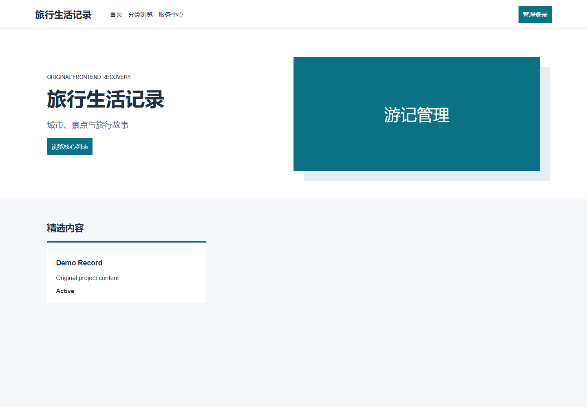
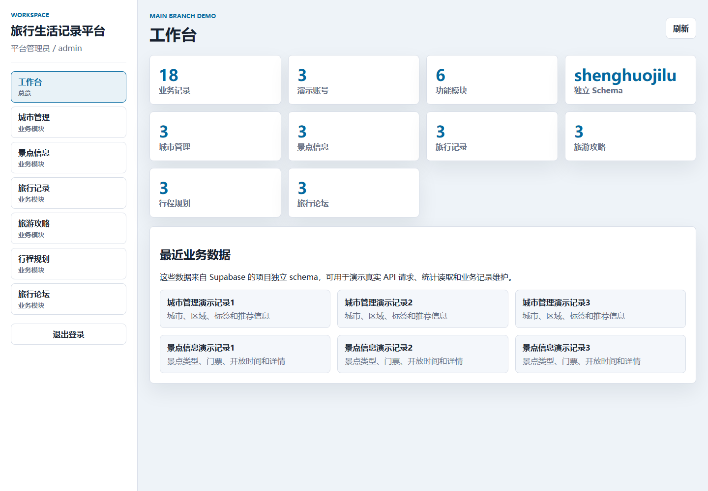
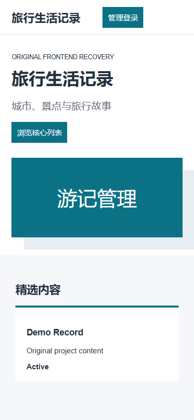

# 旅行生活记录平台

围绕城市、景点、旅行记录、攻略、行程规划和论坛的生活记录演示系统。


## 在线演示

| 项目 | 地址 |
|---|---|
| GitHub 仓库 | https://github.com/Nemo-netone/ot-shenghuojilu |
| 演示地址 | https://ot-shenghuojilu.pages.dev |
| 生产分支 | `main` |
| Cloudflare Pages | `ot-shenghuojilu` |
| Supabase schema | `ot_shenghuojilu` |

## 演示账号

| 类型 | 用户名 | 密码 | 权限 |
|---|---|---|---|
| 平台管理员 | `admin` | `admin` | admin |
| 旅行用户 | `用户账号1` | `123456` | user |
| 内容运营 | `运营01` | `123456` | staff |

这些账号只用于公开演示。请不要在演示系统里录入真实手机号、身份证、地址、订单或支付信息。

## 截图

| 首页 / 工作台 | 管理视图 | 移动端 |
|---|---|---|
|  |  |  |

## 功能模块

- **城市管理**：城市、区域、标签和推荐信息
- **景点信息**：景点类型、门票、开放时间和详情
- **旅行记录**：用户游记、图片、时间和路线
- **旅游攻略**：攻略、收藏、评论和推荐
- **行程规划**：行程安排、日期、城市和状态
- **旅行论坛**：帖子、举报、敏感词和互动

## 技术栈

- 原始项目：Spring Boot + Vue + MySQL，原始工程位于 springbootlvyouweb。
- 线上演示：Cloudflare Pages + Pages Functions + Supabase
- 数据隔离：所有演示数据写入 `ot_shenghuojilu`，不覆盖 Supabase `public` 或其他项目 schema
- API 形态：同域 `/api/*`，由 `site/_worker.js` 处理

## 本地预览

```powershell
npx wrangler@3 pages dev site
```

如需连接真实 Supabase，需要在 Cloudflare Pages 或本机临时环境中配置：

```text
SUPABASE_URL=<supabase-url>
SUPABASE_ANON_KEY=<supabase-anon-key>
SUPABASE_SCHEMA=ot_shenghuojilu
CORS_ALLOWED_ORIGINS=https://ot-shenghuojilu.pages.dev
```

## 部署说明

详细部署记录见 [docs/deployment.md](docs/deployment.md)。功能树和使用场景见 [docs/features.md](docs/features.md)。演示账号范围见 [docs/accounts.md](docs/accounts.md)。

## 已知限制

- 这是作品集可演示版本，重点保证浏览、登录、统计、增删改查流程稳定。
- 原始 Java/Vue/MySQL 项目源码保留在仓库中，线上不直接运行 Tomcat/Spring Boot。
- 文件上传、真实支付、短信、地图、AI 或第三方平台能力在演示版中不接入真实服务。

## 许可协议

本项目使用 PolyForm Noncommercial License 1.0.0。允许非商业学习、使用和修改；商业使用需要单独授权。
